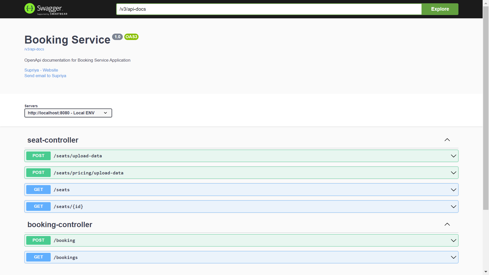

<h1 align="center"> 🧑‍💻Booking Service Application💻🎬 </h1>

This is a simple booking service application built using the Spring Boot framework with MySQL as the data store.

## Table of Contents
- [Introduction](#introduction)
- [Features](#features)
- [Getting Started](#getting-started)
- [API Endpoints](#api-endpoints)
- [Notification Integration](#notification-integration)
- [Data Upload Script](#data-upload-script)
- [Customization](#customization)

## Introduction

Welcome to the Booking Service application! This simple yet powerful service provides a platform for users to effortlessly choose seats and make bookings. Developed using the Spring Boot framework with MySQL as the underlying data store, this application introduces dynamic pricing based on seat class occupancy, ensuring a flexible and user-friendly booking experience.

## Features

- **Get All Seats:** Retrieve a list of all seats, ordered by seat class, with booking status.
- **Get Seat Pricing:** Get seat details along with pricing based on seat class booking history.
- **Create Booking:** Book seats and receive a booking ID and total amount.
- **Retrieve Bookings:** View all bookings created by a user based on email or phone number.
- **Notification Integration:** Receive confirmation notifications (Email or SMS) when a booking is created.
- **Data Upload Script:** Easily upload default data to the database from a CSV file.

## Getting Started

1. **Clone the Repository:**
   ```bash
   git clone https://github.com/soumitra2001/Booking-Service.git
   ```

2. **Configure Database:**
   - Open `src/main/resources/application.properties` and configure your MySQL database settings.

3. **Run the Application:**
   ```bash
   ./mvnw spring-boot:run
   ```
   or use your preferred method.

4. **Explore API Endpoints:**
   - Visit [http://localhost:8080/swagger-ui/index.html](http://localhost:8080/swagger-ui/index.html) for interactive API documentation.

## API Endpoints

- **Get All Seats:** `GET http://localhost:8080/api/seats`
- **Get Seat Pricing:** `GET http://localhost:8080/api/seats/{id}`
- **Create Booking:** `POST http://localhost:8080/api/booking`
- **Retrieve Bookings:** `GET http://localhost:8080/api/bookings?userEmail={userEmail}`



## Notification Integration

- Email notifications are sent when a booking is created. Update the `NotificationService` with your email sending logic and credentials.

## Data Upload Script

- Execute the data upload script by making a POST request to `http://localhost:8080/seats/upload-data` for upload Seat data
- Execute the data upload script by making a POST request to `http://localhost:8080/seats/pricing/upload-data` to upload SeatPricing data

## Customization

Feel free to customize this application based on your specific needs. You can modify the source code, add new features, or integrate additional services.
